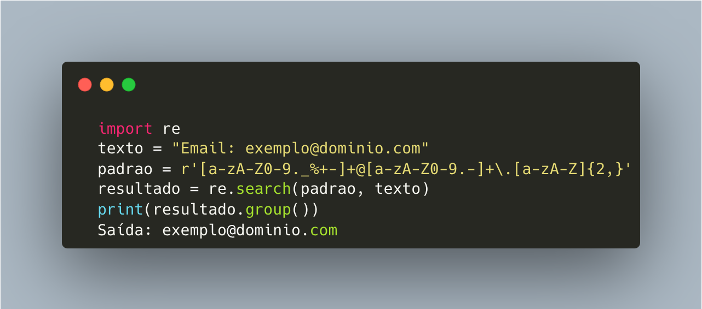
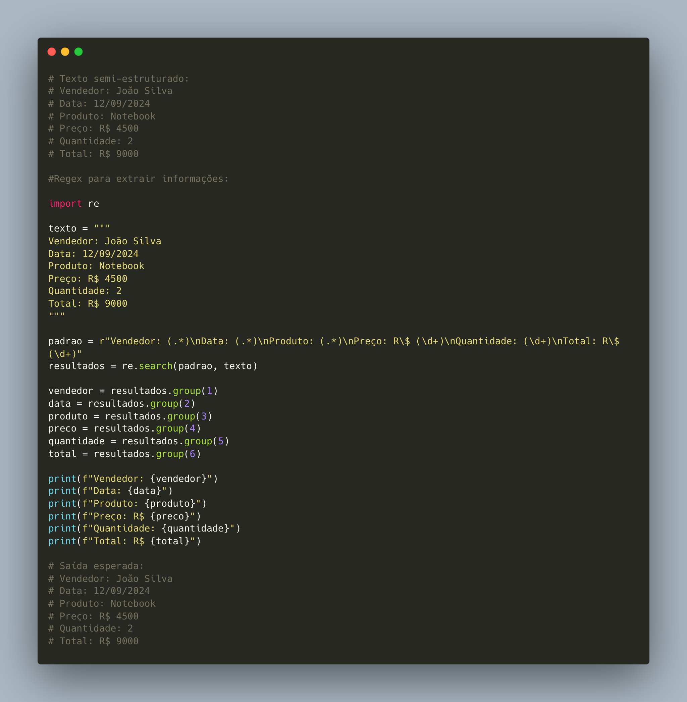
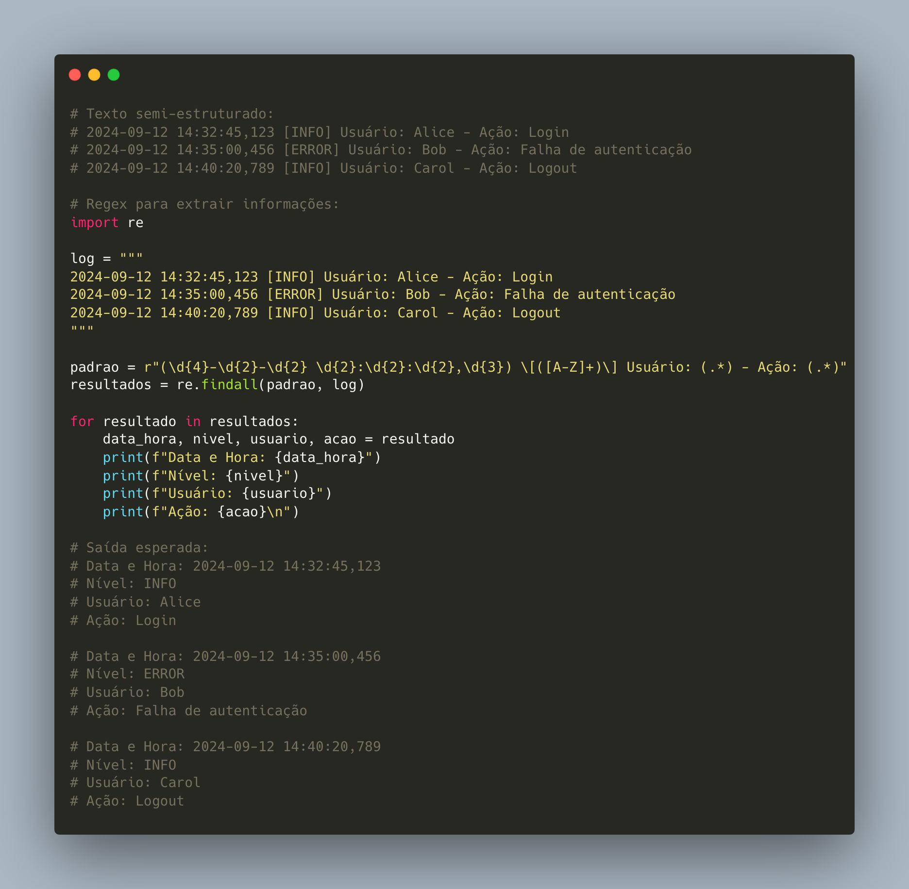
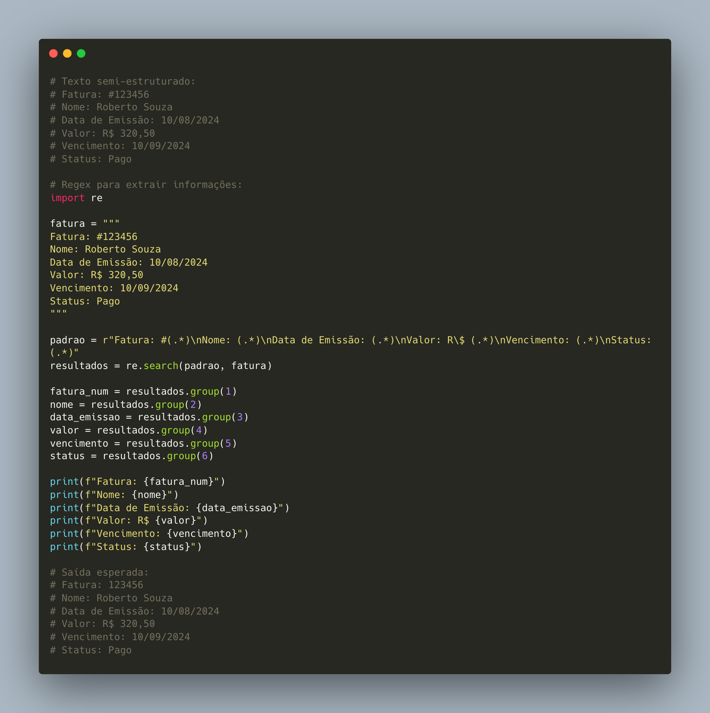
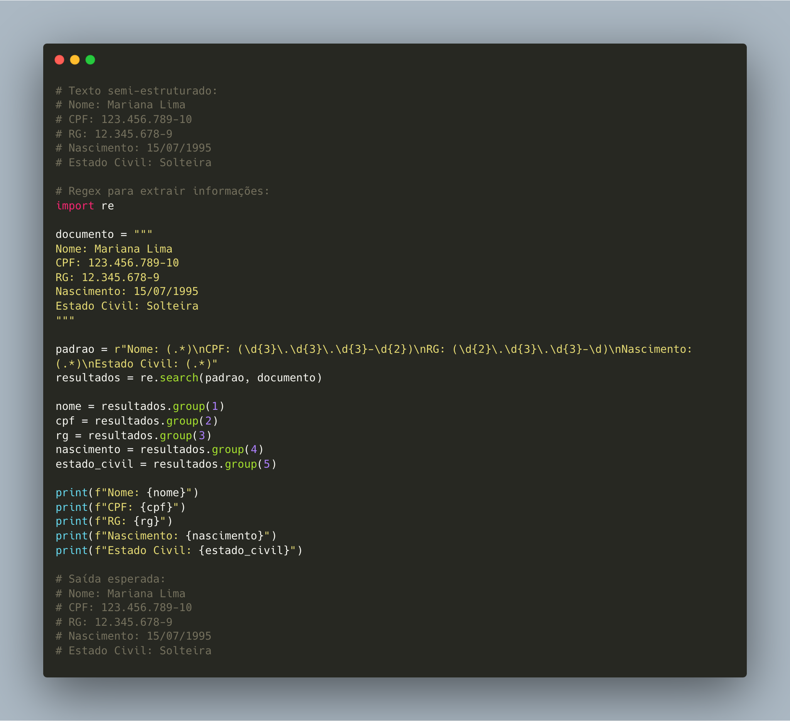

#  Aula de Expressões Regulares (Regex)

Expressões regulares, ou regex (regular expressions), são padrões usados para identificar ou manipular partes de texto. Elas são amplamente utilizadas em diversas linguagens de programação para busca e substituição de strings, validação de dados, entre outros.

1) ##  Conceitos Básicos

   1) ### Letras e Números  

      

   Uma expressão regular pode consistir de caracteres literais como letras (\`a\`, \`b\`, \`c\`) ou números (\`0\`, \`1\`, \`2\`).  
   \- Exemplo: \`abc\` corresponde exatamente à string \`"abc"\`.

2) ### Metacaracteres  

   Alguns caracteres têm um significado especial em expressões regulares:  
   \- \`.\` (ponto) — Corresponde a qualquer caractere, exceto uma nova linha.  
 	\- Exemplo: \`a.c\` corresponde a \`"abc"\`, \`"a1c"\`, \`"a-c"\`, mas não \`"ac"\` ou \`"abbc"\`.  
   \- \`^\` (circunflexo) — Corresponde ao início da string.  
 	\- Exemplo: \`^a\` corresponde a \`"apple"\`, mas não \`"banana"\`.  
   \- \`$\` (cifrão) — Corresponde ao final da string.  
 	\- Exemplo: \`t$\` corresponde a \`"cat"\`, mas não \`"cats"\`.

2) ##  Quantificadores

Os quantificadores especificam quantas vezes um caractere ou grupo de caracteres pode aparecer:

1) ### \`\*\` — Zero ou mais vezes.

  		 \- Exemplo: \`a\*\` corresponde a \`""\`, \`"a"\`, \`"aa"\`, \`"aaa"\`.  
   

### 

2) ### \`+\` — Uma ou mais vezes.

      \- Exemplo: \`a+\` corresponde a \`"a"\`, \`"aa"\`, \`"aaa"\`, mas não \`""\`.

   

3) ### \`?\` — Zero ou uma vez.

   		\- Exemplo: \`a?\` corresponde a \`""\` ou \`"a"\`.

4) ### \`{n}\` — Exatamente n vezes.

   		\- Exemplo: \`a{2}\` corresponde a \`"aa"\`, mas não \`"a"\` ou \`"aaa"\`.  
   

5) ### \`{n,}\` — Pelo menos n vezes.

  		 \- Exemplo: \`a{2,}\` corresponde a \`"aa"\`, \`"aaa"\`, etc.  
   

6) ### \`{n,m}\` — Entre n e m vezes.

   		\- Exemplo: \`a{2,4}\` corresponde a \`"aa"\`, \`"aaa"\`, ou \`"aaaa"\`.

3) ## Grupos e Alternâncias

   1) ### Parênteses \`()\` — Usados para agrupar partes da regex.

  		 \- Exemplo: \`(abc)+\` corresponde a \`"abc"\`, \`"abcabc"\`, etc.  
   

2) ### Barra Vertical \`|\` — Representa "OU".

 		 \- Exemplo: \`a|b\` corresponde a \`"a"\` ou \`"b"\`.

4) ## Conjuntos de Caracteres

   1) ### Colchetes \`\[\]\` — Definem um conjunto de caracteres.

   \- Exemplo: \`\[abc\]\` corresponde a \`"a"\`, \`"b"\`, ou \`"c"\`.

   2) ### Intervalos — Usados dentro dos colchetes para definir um intervalo de caracteres.

  		\- Exemplo: \`\[a-z\]\` corresponde a qualquer letra minúscula.

3) ### Negação — Um circunflexo dentro de colchetes nega o conjunto.

  		\- Exemplo: \`\[^a-z\]\` corresponde a qualquer caractere que não seja uma letra minúscula.

5) ## Classes de Caracteres Predefinidas

   1) ### \`\\d\` — Corresponde a qualquer dígito (\`\[0-9\]\`).

   2) ### \`\\D\` — Corresponde a qualquer caractere que não seja um dígito.

   3) ### \`\\w\` — Corresponde a qualquer caractere de palavra (\`\[a-zA-Z0-9\_\]\`).

   4) ### \`\\W\` — Corresponde a qualquer caractere que não seja de palavra.

   5) ### \`\\s\` — Corresponde a qualquer espaço em branco (inclui espaços, tabulações, novas linhas).

   6) ### \`\\S\` — Corresponde a qualquer caractere que não seja um espaço em branco.

   

   

   

6) ##  Ferramentas e Bibliotecas

\- No Python, a biblioteca \`re\` é usada para trabalhar com expressões regulares. Exemplo:

7) ## Exemplos Práticos

   1) ### Validar e-mails  

       \- Expressão: \`^\[a-zA-Z0-9.\_%+-\]+@\[a-zA-Z0-9.-\]+\\.\[a-zA-Z\]{2,}$\`  
      \- Explicação: Essa regex valida um formato básico de e-mail.

   2) ### Buscar datas no formato DD/MM/AAAA  

      \- Expressão: \`\\b\\d{2}/\\d{2}/\\d{4}\\b\`  
      \- Explicação: Procura por datas como \`"12/09/2024"\`.

   3) ### Encontrar palavras que começam com "J" e terminam com "a"  

      \- Expressão: \`\\bJ\\w\*a\\b\`  
      \- Explicação: Corresponde a palavras como \`"Julia"\`, \`"Joaquina"\`.

4) ### Extrair informações de um relatório de vendas

5) ### Extrair logs de sistema

   6) ### Extrair informações de uma fatura

### 

7) ### Extrair informações de um documento de identidade

## 

8) ## Links Importantes e Referências

   1) [Regex 101](https://regex101.com/)  
   2) [Regexr](https://regexr.com/)  
   3) [W3Schools](https://www.w3schools.com/python/python_regex.asp)  
   4) [Documentação RE \- Python](https://docs.python.org/3/library/re.html)